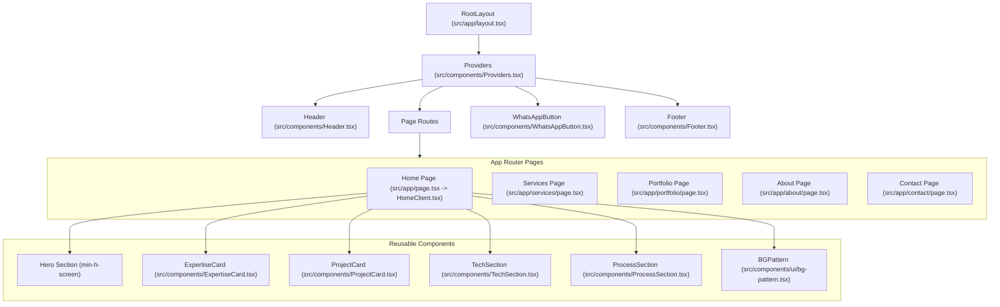

# Sevora Lab — UI Architecture & Design Documentation

This document details the frontend UI architecture, design system, component hierarchy, and routing strategy for **Sevora Lab** (`sevoralab.studio`).

---

## 1. Overview & Technology Stack

Sevora Lab is built as a high-performance, dark cosmic digital studio platform.

* **Core Framework:** Next.js 15+ (App Router, Server & Client Components)
* **Language:** TypeScript
* **Styling & Utilities:** Tailwind CSS, PostCSS, `clsx`, `tailwind-merge` (`cn` utility)
* **Animation & Motion:** Framer Motion
* **Iconography:** Lucide React
* **Typography:** Google Fonts (`Outfit` for headings, `Inter` for body)

---

## 2. Global Architecture Diagram



---

## 3. Directory & File Structure

```
d:/project/sevora_lab/
├── public/                     # Static assets (images, logos, icons)
│   ├── images/                 # Portfolio & background images
│   └── Clogo.png               # Brand logo mark
├── src/
│   ├── app/                    # Next.js App Router
│   │   ├── layout.tsx          # Root layout (fonts, providers, global layout)
│   │   ├── page.tsx            # Home page server wrapper
│   │   ├── HomeClient.tsx      # Main interactive Home page component
│   │   ├── services/           # /services page route
│   │   ├── portfolio/          # /portfolio page route
│   │   ├── about/              # /about page route
│   │   ├── contact/            # /contact page route
│   │   ├── admin/              # Admin CMS management routes
│   │   └── globals.css         # Global CSS & Tailwind layers
│   ├── components/             # Reusable UI Components
│   │   ├── Header.tsx          # Fixed floating navbar (transitions on scroll)
│   │   ├── Footer.tsx          # Main studio footer with quick links & branding
│   │   ├── ExpertiseCard.tsx   # Glassmorphic service feature card
│   │   ├── ProjectCard.tsx     # Portfolio project showcases with hover glow
│   │   ├── TechSection.tsx     # Animated technology stack grid
│   │   ├── ProcessSection.tsx  # Studio workflow step breakdown
│   │   ├── WhatsAppButton.tsx  # Floating quick-chat widget
│   │   ├── Providers.tsx       # Theme & context providers wrapper
│   │   └── ui/                 # Atomic primitives (Button, BGPattern, etc.)
│   ├── data/                   # Data layer & TypeScript interfaces
│   │   ├── services.ts         # Active services array & Service interface
│   │   └── portfolio.ts        # Portfolio items & category definitions
│   └── lib/                    # Shared utility functions
│       └── utils.ts            # ClassName merging helper (cn)
├── DESIGN.md                   # Visual design system tokens & rules
└── UI_ARCHITECTURE.md          # UI Architecture & component guide
```

---

## 4. UI Layer Breakdown & Design System

### 4.1 Color System & Palette Matrix

### 4.1 Color System & Palette Matrix

The project uses a **Refined Navy + Bright Blue + Pure White** color palette configured in [`src/app/globals.css`](file:///d:/project/sevora_lab/src/app/globals.css) and Tailwind theme variables:

| Color Name | HEX / Value | CSS / Token Variable | Role & Usage |
| :--- | :--- | :--- | :--- |
| **Deep Navy** | `#071A2B` | `--background`, `--color-background-custom` | Main application dark background canvas |
| **Navy Blue** | `#0B2742` | `--surface`, `--color-surface` | Elevated surfaces, card backgrounds & panels |
| **Pure White** | `#FFFFFF` | `--foreground`, `--color-text-custom` | Main headings, active navigation & primary text |
| **Soft White** | `#EAF4FF` | `--text-secondary`, `--color-text-secondary` | Paragraphs, descriptions & secondary content |
| **Bright Blue (Accent)** | `#1677FF` | `--accent`, `--color-accent` | Primary action buttons, active borders & glows |
| **Sky Blue (Hover)** | `#4DA3FF` | `--accent-hover`, `--color-accent-hover` | Button hover states & sky-blue highlights |
| **Light Blue** | `#B9E2FF` | `--accent-light`, `--color-primary-end` | Soft gradient endpoints & decorative accents |
| **Translucent Glass** | `rgba(255,255,255,0.04)` | `.glass` | Glassmorphic card surface fill |
| **Sky-Blue Glass Border**| `rgba(185,226,255,0.12)`| `border-white/10` | Container boundaries & card outlines |
| **Blue Glow Shadow** | `rgba(22,119,255,0.35)` | `.blue-glow` | Drop shadows for interactive focus & hover states |

### 4.2 Typography Hierarchy
* **Headings (`Outfit`):** `font-extrabold tracking-tight`
* **Body (`Inter`):** `font-sans leading-relaxed`

### 4.3 Glassmorphism & Elevation System
* **Cards & Containers:** `bg-white/5 backdrop-blur-md border border-white/10`
* **Hover State:** Border shifts to `#3B82F6` with subtle blue glow `shadow-[0_0_25px_rgba(59,130,246,0.25)]`.

---

## 5. Key Page Components Architecture

### 1. Root Layout (`src/app/layout.tsx`)
Provides the base HTML structure, font configurations (`Outfit` & `Inter`), global providers, layout wrapper, and sticky floating widgets (`WhatsAppButton`).

### 2. Header (`src/components/Header.tsx`)
* **State:** Monitors window scroll position (`scrolled > 20px`).
* **Behavior:** Smoothly transforms from top full-width header to a rounded floating glass pill (`bg-[#020617]/85 backdrop-blur-md`).

### 3. Hero Section (`src/app/HomeClient.tsx`)
* **Height:** Full screen (`min-h-screen`).
* **Layout:** Centered typography and quick stats showcase (`10+ Projects`, `10+ Clients`, `2+ Years`).
* **Micro-interaction:** Animated scroll down indicator (`ChevronDown`) at bottom viewport boundary.

### 4. Data Driven Components (`src/data/services.ts` & `src/data/portfolio.ts`)
* Service items and portfolio projects are decoupled into pure TypeScript data schemas.
* Modifications to services or portfolio items automatically propagate to both Home and detail pages seamlessly.

---

## 6. Verification & Guidelines

1. **Responsive Behavior:** Every component uses Tailwind mobile-first design (`sm:`, `md:`, `lg:` breakpoints).
2. **Performance Optimization:** Next.js dynamic imports, Next Image optimization, lazy animation execution.
3. **Accessibility:** High contrast text ratio, semantic HTML5 elements (`<header>`, `<main>`, `<section>`, `<footer>`).
